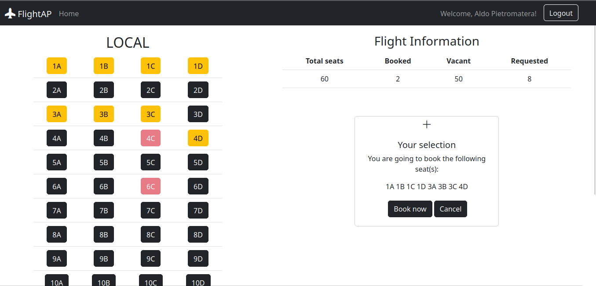

# "Posti aereo"
## Student: s308762 PIETROMATERA ALDO 

## React Client Application Routes

- Route `/`: initial page in which the user can choose among three kinds of flights.
- Route `/seats/:plane_id` : situation of the plane given its id.
- Route `/login`: login form.
- Route `*` : None of the above.

## API Server
- GET `/api/flights` - retrieve the list of all the available flights
  - Request body: _None_
  - Response: `200 OK` (success)
  - Response body: Array of objects, each describing one flight:

    ``` json
    [ 
      {"id": 1, "type": "local", "rows": 15, "seats_per_row": 4},
      {"id": 2, "type": "regional", "rows": 20, "seats_per_row": 5},
      { "id": 3, "type": "international", "rows": 25, "seats_per_row": 6 },
      ...
    ]
    ```
    OR

    ``` json
    {"error": "There are no flights"}
    ```
  - Error responses:  `500 Internal Server Error` (generic error)


- GET `/api/flights/:id/bookings` - retrieve bookings for a flight, given its id
  - Request body: _None_
  - Response: `200 OK` (success)
  - Response body: Array of objects, each with only the 'seat' attribute. Or, alternatively, an object containing the 'error' attribute.

    ``` json
    [ {"seat": "5A"}, {"seat": "18B"}, ... ]
    ```
     OR

    ``` json
    {"error": "There are no bookings for this flight"}
    ```
  - Error responses:  `500 Internal Server Error` (generic error), `422 Unprocessable Content`

- GET `/api/flights/:id/user-booking` - retrieve user bookings, given the id of the plane. [Auth.]
  - Request body: _None_
  - Response: `200 OK` (success)
  - Response body: Array of objects, each with only the 'seat' attribute. Or, alternatively an object containing the 'error' attribute.

    ``` json
    [ {"seat": "5A"}, {"seat": "18B"}, ... ]
    ```
    OR

    ``` json
    { "error": "There are no bookings for this user" }
    ```
  - Error responses:  `500 Internal Server Error` (generic error), `422 Unprocessable Content`

- DELETE `/api/flights/:id/user-booking` - delete all the bookings of the user on a given flight. [Auth.]
  - Request body: _None_
  - Response: `200 OK` (success)
  - Response body: number of deleted bookings on this flight for the current user
  - Error responses:  `503 Service Unavailable` (database error), `422 Unprocessable Content`, `404 Not Found`

  <br>

- POST `/api/flights/:id/user-booking` - create a new booking, by providing all relevant information. [Auth.]
  - Request body: Array of seats to be booked:
    ``` JSON
    [{"seat": "5A"}, {"seat": "20A"}, ...]
    ```
  - Response: `200 OK` (success with an empty array if it is all ok)
  - Error responses:  `503 Service Unavailable` (database error), `422 Unprocessable Content`, `403 Forbidden` (user has already booked this flight or some seats have been already booked by other users. In the second case, the array of rejected seats will be sent as response body)

    ``` JSON
    [{ "plane_id": "1", "seat": "5A", "user": "4"}, ...]
    ```
   

  ### User management
- POST `/api/sessions` - used for performing login
  - Request body: credentials of the user who is trying to login

    ``` JSON
    {"email": "email", "password": "password"}
    ```
  - Response: `200 OK` (success)
  - Response body: authenticated user

    ``` JSON
    { "id": 4, "email": "aldo@email.it", "name": "Aldo Pietromatera"}
    ```
  - Error responses:  Error responses:  `500 Internal Server Error` (generic error), `401 Unauthorized User` (login failed)

- GET `/api/sessions/current` - checks whether the user is logged in or not
  - Request body: _None_
  - Response: `200 OK` (success)
  - Response body: authenticated user

    ``` JSON
    { "id": 4, "email": "aldo@email.it", "name": "Aldo Pietromatera"}
    ```
  - Error responses:  Error responses:  `500 Internal Server Error` (generic error), `401 Unauthorized User` (login failed)

- DELETE `/api/sessions/current` - logout current user
  - Request body: _None_
  - Response: `200 OK` (success)
  - Response body: _None_
  - Error responses:  Error responses:  `500 Internal Server Error` (generic error), `401 Unauthorized User`

## Database Tables
 Primary keys underlined

- Table `users` - ( <ins>id</ins>, name, email, hash, salt )
- Table `flights` - ( <ins>id</ins>, type, rows, seats_per_row )
- Table `bookings` - ( <ins>plane_id</ins>, <ins>seat</ins>, user_id )

## Main React Components
- `Navigation` (in `Navigation.jsx`) - navigation bar
- `LoginForm` (in `Auth.jsx`) - used to show the form to perform login
- `PlaneView` (in `PageLayout.jsx`): MAIN component. It is the root for all the inner components. It contains the useEffect to retrieve info about flights and users bookings.
    In addition, it contains all the handles to deal with the correct usage of the SPA.
- `SeatDisposition` (in `PageLayout.jsx`): used to show the layout of the seats in the plane with `SeatRow` and `Seat`.
- `LoggedInfo` (in `PageLayout.jsx`): used to show all components enabled when there is a user logged in.
- `WhileBooking` (in `PageLayout.jsx`): used to show and manage the process of booking.
- `Book` (in `PageLayout.jsx`): used to show and manage a booking. It allows also to delete the booking.

## Screenshots


## Users Credentials

Here you can find a list of the users already registered.
<br>

|         email         |   name                | plain-text password | notes
|-----------------------|-----------------------|---------------------|--------------------------------------
| aldo@email.it         | Aldo Pietromatera     | pass                | has bookings on local and regional
| maria@email.it        | Maria Rossi           | pass                | has bookings on local and international
| angelo@email.it       | Angelo Duro           | pass                | has no initial bookings
| lollo@email.it        | Michele Lorenzo       | pass                | has no initial bookings

